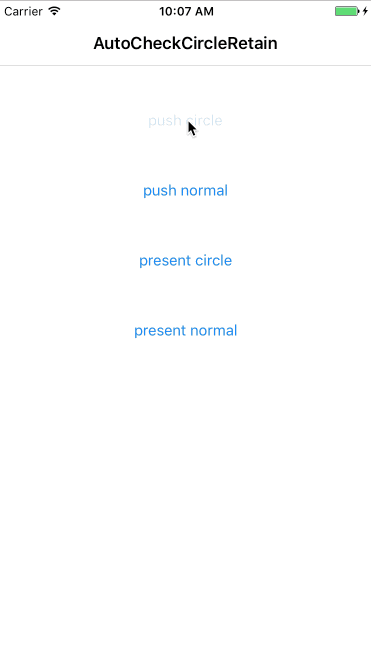

# AutoCheckCircleRetain
Checking retain circle automatically. 
自动检测项目中的循环引用 

#Why
Annoying retain circle. 
烦人的循环引用。
#How to use
Download this project add drag the class dir to your project.
Doesn't need to write any code. 
下载工程并把class文件夹的内容拖到你的工程。无需写任何代码。
#Note
It works in DEBUG only. 
默认只在DEBUG模式有效。

